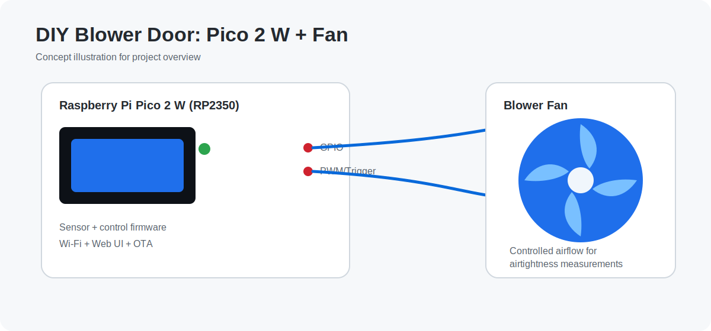

# DIY Blower Door Firmware

Embedded firmware for **Raspberry Pi Pico 2 W (RP2350)** built for Blower Door testing: dual pressure sensing, fan control, live web telemetry, and OTA updates.


## 🔎 Quick navigation

- [Quick start](#-quick-start)
- [Replication guide](docs/REPLICATION_GUIDE.md)
- [Build options](#%EF%B8%8F-build-options)
- [Versioning and releases](#-versioning-and-releases)
- [Web + API](#-web--api)
- [Troubleshooting](#-troubleshooting)
- [Contributing](CONTRIBUTING.md)
- [Security](SECURITY.md)

## 📸 Prototype concept



---

## 🏠 What is this for?

A **Blower Door** is used to measure the airtightness of a building envelope.

This project is specifically focused on **airtightness testing for Passive House-style homes** (high-performance low-leakage construction), where validating envelope tightness is critical for comfort, energy efficiency and certification workflows.

### Main motivation

The core goal is to make airtightness testing more accessible, so **you can verify the airtightness of your own home** without relying on expensive proprietary equipment.

---

## 🧩 PCB product roadmap

We are currently developing a dedicated **PCB version** of this system that will be available for purchase soon.

For early purchase interest and availability updates, write to:

**[order@pedromartinezweb.com](mailto:order@pedromartinezweb.com)**

---

## ✨ What this project does

- Runs a modular **FreeRTOS** architecture on RP2350.
- Reads **2x ADP910** sensors on independent I2C buses:
  - sensor #1: fan differential pressure / temperature
  - sensor #2: envelope differential pressure / temperature
- Controls blower output through a dimmer path.
- Serves a responsive embedded web app over Wi-Fi.
- Streams live telemetry via **SSE** (`/events`) with fallback polling.
- Supports **OTA firmware updates** (staging + CRC validation + apply/reboot).

---

## 🧱 Architecture at a glance

Key runtime modules:

- `src/main.c` → startup and scheduler handoff
- `src/app/task_bootstrap.c` → task registration/composition
- `src/tasks/adp910_task.c` → periodic sensor acquisition
- `src/tasks/dimmer_task.c` → dimmer output/control loop
- `src/tasks/wifi_task.c` → Wi-Fi + HTTP/SSE runtime
- `src/services/blower_metrics.c` → measurement/maths
- `src/services/blower_control.c` → control state coordination
- `src/drivers/adp910/adp910_sensor.c` → ADP910 driver

High-level layers:

- `platform` → runtime faults/hooks
- `app` → app composition
- `tasks` → periodic execution
- `drivers` → hardware access
- `services` → shared logic and state

---

## 🔌 Hardware mapping (default)

Defined in `include/app/app_config.h`.

- Dimmer path
  - `Z-C` input: `GPIO2`
  - `D1` trigger output: `GPIO3`
- ADP910 #1 (fan)
  - I2C: `i2c0`
  - SDA: `GPIO4`
  - SCL: `GPIO5`
- ADP910 #2 (envelope)
  - I2C: `i2c1`
  - SDA: `GPIO6`
  - SCL: `GPIO7`
- Default ADP910 address: `0x25`

Power notes:

- Feed Pico 2 W from **5V** (`USB` or `VSYS`).
- Use `3V3(OUT)` for ADP910 and other 3.3V logic.
- RP2350 GPIO are **3.3V only**.

---

## 📁 Repository layout

- `src/` firmware source
- `include/` headers and app configuration
- `web/` and `include/web/` static web assets
- `scripts/` build/flash/OTA/helper scripts
- `docs/` technical docs and references
- `CMakeLists.txt` build entry point

---

## 🗺️ Documentation map

- `docs/REPLICATION_GUIDE.md` -> end-to-end setup and first build
- `docs/PINOUT_PICO2W.md` -> wiring and electrical mapping
- `docs/web_endpoint_mapping.md` -> web/firmware API contract
- `docs/plan.md` -> architecture and implementation notes

---

## ⚙️ Prerequisites

Install/configure:

- Pico SDK
- FreeRTOS-Kernel
- ARM GNU Toolchain (`arm-none-eabi-*`)
- CMake (Ninja optional)
- `probe-rs` (for SWD flashing)

Typical variables:

- `PICO_SDK_PATH`
- `FREERTOS_KERNEL_PATH`
- `PICO_TOOLCHAIN_PATH` (if toolchain is not in `PATH`)

---

## 🚀 Quick start

```bash
git clone https://github.com/polo14va/DIY_blower_door.git
cd DIY_blower_door
cp .wifi-secrets.example .wifi-secrets
```

Edit `.wifi-secrets`:

```text
WIFI_SSID=your_wifi_ssid
WIFI_PASSWORD=your_wifi_password
```

Validate local environment:

```bash
./scripts/doctor.sh
```

Build and flash firmware:

```bash
./scripts/build_flash_rp2350.sh
```

Open the device IP shown in logs.

---

## 🛠️ Build options

One-command build/flash:

```bash
./scripts/build_flash_rp2350.sh
```

Useful overrides:

- `WEB_DIR=/absolute/path/to/web/assets`
- `BUILD_DIR=/absolute/path/to/build-dir`
- `FREERTOS_KERNEL_PATH=/absolute/path/to/FreeRTOS-Kernel`
- `PICO_SDK_PATH=/absolute/path/to/pico-sdk`
- `FIRMWARE_VERSION_OVERRIDE=x.y.z`
- `SKIP_FLASH=1` (build only)

Example (build only):

```bash
SKIP_FLASH=1 ./scripts/build_flash_rp2350.sh
```

Manual CMake flow:

```bash
cmake -S . -B build \
  -DPICO_BOARD=pico2_w \
  -DPICO_PLATFORM=rp2350 \
  -DFREERTOS_KERNEL_PATH="/path/to/FreeRTOS-Kernel" \
  -DBLOWER_WEB_SOURCE_DIR="/path/to/web"

cmake --build build --target blower_pico_c --parallel
```

Manual flash:

```bash
probe-rs download --chip RP235x --protocol swd build/blower_pico_c.elf
probe-rs reset --chip RP235x --protocol swd
```

---

## 🏷️ Versioning and releases

Single source of truth:

- Firmware version is defined in `VERSION` (semantic format `x.y.z`).
- This value is propagated to:
  - compile-time firmware macro (`APP_FIRMWARE_VERSION`)
  - OTA CLI default version label (`scripts/ota_update.py`)
  - web UI version display (top bar, OTA settings, footer)

Release command:

```bash
./scripts/release.sh patch
```

Also available:

```bash
./scripts/release.sh minor
./scripts/release.sh major
./scripts/release.sh set 1.4.0
```

What `scripts/release.sh` does by default:

1. Calculates the next semantic version.
2. Runs a full build validation (`SKIP_FLASH=1`) with that version.
3. Updates `VERSION`.
4. Creates commit `chore(release): vX.Y.Z`.
5. Creates annotated git tag `vX.Y.Z`.

Manual controls:

- `--no-commit`
- `--no-tag`
- `--allow-dirty`
- `--skip-build-check`

GitHub release automation:

- Pushing a tag `vX.Y.Z` triggers `.github/workflows/release.yml`.
- The workflow builds firmware and publishes only `.bin` and `.uf2` artifacts in GitHub Releases.

---

## 🌐 Web + API

Main endpoints:

- `GET /` → embedded UI
- `GET /api/status` → telemetry + control state
- `GET /events` → SSE stream
- `POST /api/pwm` → `{"value":0..100}`
- `POST /api/relay` → `{"value":0|1}`
- `POST /api/led` → `{"value":0|1}`

OTA endpoints:

- `GET /api/ota/status`
- `POST /api/ota/begin` → `{"size":N,"crc32":C,"version":"x.y.z"}`
- `POST /api/ota/chunk` → `{"offset":N,"data":"<base64>"}`
- `POST /api/ota/finish`
- `POST /api/ota/apply`

Notes:

- SSE is optimized for a single active client.
- UI includes fallback polling behavior.

---

## 🔄 OTA update

From web UI:

1. Open **Firmware OTA** panel.
2. Select compiled `.bin` file.
3. Set version label.
4. Upload and apply.

From CLI:

```bash
python3 ./scripts/ota_update.py \
  --host 192.168.0.31 \
  --file build/blower_pico_c.bin
```

Upload only:

```bash
python3 ./scripts/ota_update.py \
  --host 192.168.0.31 \
  --file build/blower_pico_c.bin \
  --version 1.2.0 \
  --no-apply
```

---

## 🧪 Field workflow (recommended)

1. Install/seal fan assembly.
2. Set building parameters in UI (volume, fan diameter, altitude).
3. Run zero calibration.
4. Execute n50/n75 procedure.
5. Monitor live pressure and ACH metrics.

---

## 🧰 Troubleshooting

SSE/UI not updating:

```bash
curl -sN http://<device-ip>/events | head
```

If controls fail:

- ensure same network
- avoid multiple active browser clients
- rebuild/reflash latest firmware

If embedded web is outdated:

- verify `WEB_DIR`
- do clean rebuild
- hard-refresh browser cache

---

## 🤝 Community workflow

- Use issue templates in `.github/ISSUE_TEMPLATE/` for bug reports and feature requests.
- Use `CONTRIBUTING.md` before opening pull requests.
- Use `SECURITY.md` for private vulnerability reporting.
- Keep `.wifi-secrets` private and uncommitted.

---

## 📄 License

This project is **not open source**.

See `LICENSE` for full terms. Public repository visibility does **not** grant permission to use, modify, copy, distribute, or reproduce this code.
