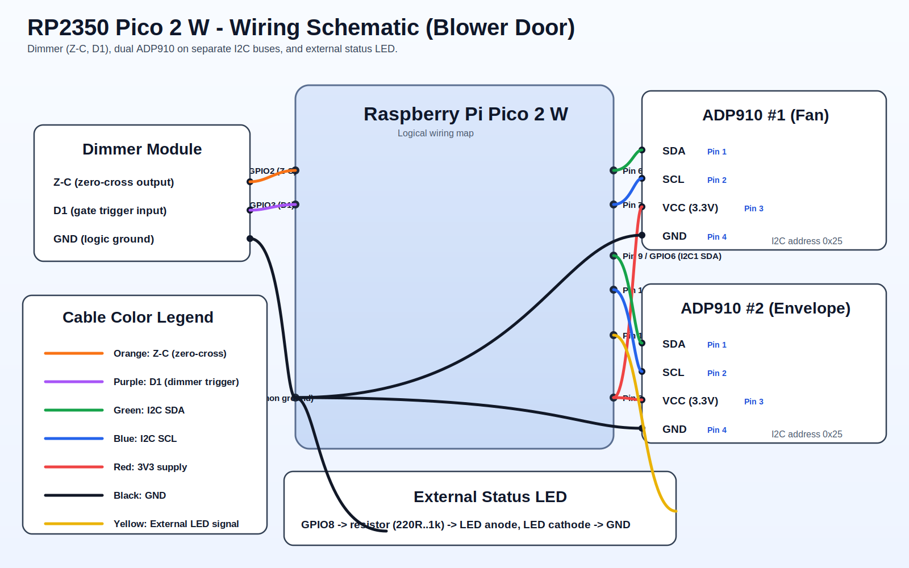

# RP2350 Pico 2 W Pinout (Blower Door)

This document defines the wiring pinout for the current firmware.

## Wiring Diagram

## Summary Table

| Subsystem | Signal | RP2350 GPIO | Pico 2 W physical pin | Connect to |
|---|---|---:|---:|---|
| Dimmer (BTA16 stage) | Zero-cross input (`Z-C`) | GPIO2 | Pin 4 | `Z-C` output from isolated dimmer interface |
| Dimmer (BTA16 stage) | Gate/trigger output (`D1`) | GPIO3 | Pin 5 | `D1` input on isolated dimmer interface |
| ADP910 #1 (Fan) | I2C SDA | GPIO4 (`i2c0`) | Pin 6 | SDA of Fan ADP910 |
| ADP910 #1 (Fan) | I2C SCL | GPIO5 (`i2c0`) | Pin 7 | SCL of Fan ADP910 |
| ADP910 #2 (Envelope) | I2C SDA | GPIO6 (`i2c1`) | Pin 9 | SDA of Envelope ADP910 |
| ADP910 #2 (Envelope) | I2C SCL | GPIO7 (`i2c1`) | Pin 10 | SCL of Envelope ADP910 |
| External status LED | LED drive output (recommended) | GPIO8 | Pin 11 | LED anode through resistor |

## Power and Ground Connections

- Pico 2 W board supply (recommended):
  - Use **5V input** to the board (`USB` or `VSYS` path).
  - The Pico regulator then provides stable `3V3(OUT)` for logic/sensors.
- Do not use GPIO at 5V:
  - RP2350 GPIO logic is **3.3V only**.
  - `Z-C` and `D1` interface signals to the Pico must be 3.3V-compatible.
- ADP910 #1 and ADP910 #2:
  - `3V3(OUT)` from Pico 2 W (Pin 36) -> sensor VCC
  - Any Pico GND pin -> sensor GND
- Dimmer module (logic side, BTA16 interface):
  - Pico GND -> dimmer logic GND (mandatory shared logic reference)
- External LED:
  - GPIO8 (Pin 11) -> series resistor (220 ohm to 1k ohm) -> LED anode
  - LED cathode -> GND

## BTA16 Dimmer Note

- `BTA16` is the power triac stage.
- The Pico must **not** connect directly to mains or directly to a bare triac gate.
- Use an isolated control front-end (typical: optotriac for trigger + isolated zero-cross detector).
- In this firmware:
  - `Z-C` is an input into GPIO2.
  - `D1` is a trigger output from GPIO3.

## Why Two Separate I2C Buses

Both ADP910 devices use the same I2C address (`0x25` in current firmware), so they are intentionally separated:

- Fan sensor on `i2c0` (GPIO4/GPIO5)
- Envelope sensor on `i2c1` (GPIO6/GPIO7)

This avoids address collisions.

## Firmware Mapping Reference

Current firmware pin definitions:

- Dimmer:
  - `DIMMER_ZERO_CROSS_PIN 2u`
  - `DIMMER_GATE_PIN 3u`
  - Source: `src/tasks/dimmer_task.c`
- ADP910 buses and pins:
  - `APP_ADP910_FAN_SENSOR_SDA_PIN 4u`
  - `APP_ADP910_FAN_SENSOR_SCL_PIN 5u`
  - `APP_ADP910_ENVELOPE_SENSOR_SDA_PIN 6u`
  - `APP_ADP910_ENVELOPE_SENSOR_SCL_PIN 7u`
  - Source: `include/app/app_config.h`

## External LED Status Note

- The firmware currently controls the onboard Pico W Wi-Fi LED (`CYW43_WL_GPIO_LED_PIN`) for network activity.
- `GPIO8` is documented here as the dedicated external status LED output to indicate fan running state.
- If you want this LED behavior active in firmware (ON when fan is running, OFF otherwise), implement LED update logic using blower control `relay/pwm` state.

## Safety Notes

- Do not connect AC mains directly to Pico GPIO pins.
- Use a properly isolated dimmer interface with optocouplers.
- Keep all sensor and control logic at 3.3 V compatible levels.
